# Lab companion — Federated Query with BigQuery and AlloyDB

Day 2 (Tue Oct 6), 10:45–11:15. The lab's own step-by-step lives in your Google Skills classroom seat (listed there as "Federated Query with BigQuery"); this companion is the orientation around it — what you're building, why, and what tends to go wrong.

**Watch first:** `lab-walkthrough.mp4` (in this folder) is a full instructor run recorded live — connection, IAM grant, and both federated queries, end to end. `demo-assets.sql` (same folder) has every SQL statement used in the video, including the `web_log` and `customer_details` demo data, so you can rebuild the demo anywhere.

## The one thing to remember

> **A federated query is BigQuery's version of a linked server with `OPENQUERY`.**
>
> - The **connection resource** = the **linked server definition**: server, credentials, one-time setup.
> - **`EXTERNAL_QUERY(connection_id, '...')`** = **`OPENQUERY`**: the string inside the quotes is shipped to the remote system and executed *there*, in *its* SQL dialect.
> - And just like `OPENQUERY`: there is no browsing the remote tables — you query blind.

## What you'll do

- Connect BigQuery to an AlloyDB for PostgreSQL database (AlloyDB plays the role of a live operational store — it is not your migration target).
- Run your first `EXTERNAL_QUERY` against it.
- Join historical analytical data (in BigQuery) with live transactional rows (in AlloyDB) in a single SQL statement.

## Why it matters for your migration

During your migration, not everything moves at once. Federation means the SQL Server systems that are still operational stay reachable from BigQuery **without copying them first** — no extract job built just to join operational tables against warehouse data. This is the pattern that lets you migrate in phases instead of betting on a big-bang cutover.

The honest trade-offs, so you apply it deliberately: the source system takes the query load, results don't get BigQuery storage optimizations, federated queries are read-only, and on-demand billing charges for the bytes returned from the external side. Federation is a bridge, not a destination — Silver/Gold still belong in managed tables.

## Before you start

- Launch the lab from your seat in the [Skills classroom](https://www.skills.google/ilt/classrooms/37990) and sign in to the console with the **lab-provided credentials**, not your own account.
- Check the **project picker** at the top of the console: the lab spins up its own temporary GCP project, and everything you build must go there.
- Note the region the lab instructions give you, and keep every resource you create in that region.

## While you work — pointers, not steps

- **The connection setup is the "linked server definition" moment.** New concept, one-time work: region, connection ID, credentials. Go slowly here; once it exists, everything else is just SQL.
- **API-enable and consent prompts are expected.** If the console asks you to enable an API (for example the BigQuery Connection API) or confirm a consent screen, click through — that's normal in a fresh lab project.
- **Your first `EXTERNAL_QUERY`:** the inner statement is **PostgreSQL**, executed on the AlloyDB side. BigQuery syntax inside the quotes fails — this is the single most common trip point. Watch your quoting too: single quotes inside the inner query must be escaped (double them, or wrap the whole inner query in triple single quotes `'''...'''` the way Google's own examples do).
- **The payoff is the join:** historical/analytical data on the BigQuery side ⨝ live transactional rows on the AlloyDB side, one statement. If you get nothing else working, get this — a working connection you can re-create later is the real takeaway.

## The critical steps, in pictures (recorded from a real run)

These frames are from an instructor dry-run of this exact lab. Project IDs, student logins and passwords in them are per-lab — yours will differ; the steps are identical.

Consent and API prompts are part of the ritual in a fresh lab project — click through them.

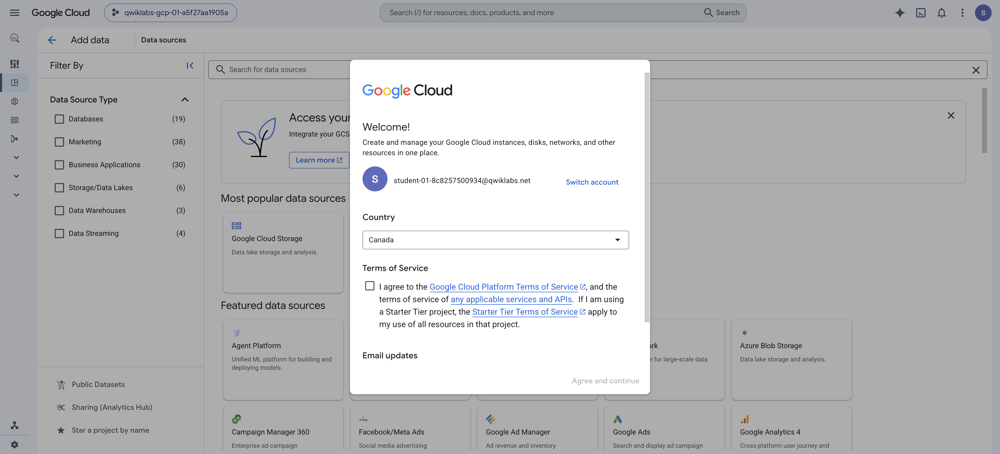

BigQuery ▸ Studio ▸ **+ Add data** ▸ Data Source Type = **Databases** ▸ the **Google Cloud AlloyDB** card.

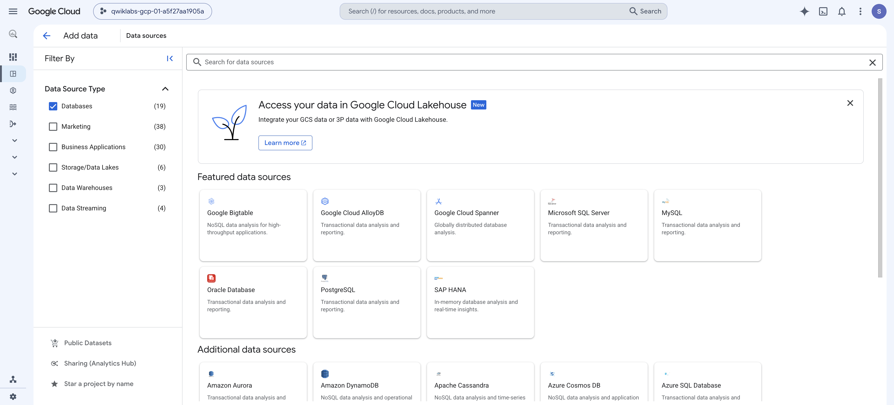

Pick **BigQuery Federation** under "Access external data in place" — federation, not a load or a Datastream replication.

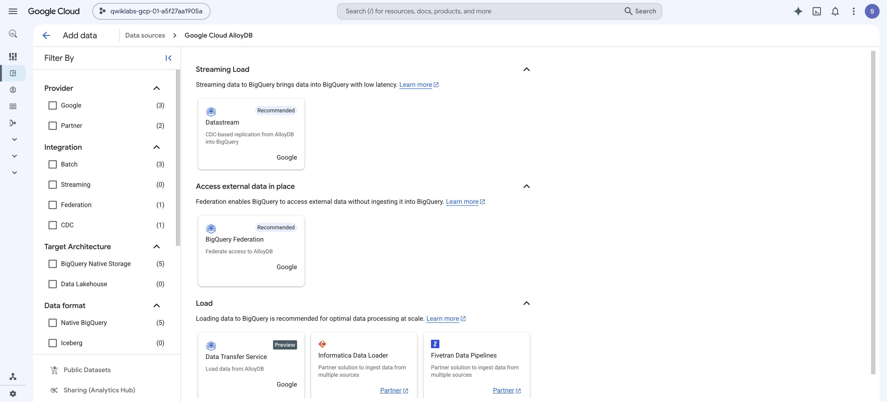

The "linked server definition" moment: Connection type **AlloyDB**, Connection ID **AlloyDB-weblog**, Location type **Region**, region **us-central1**. Go slowly here — everything after this is just SQL.

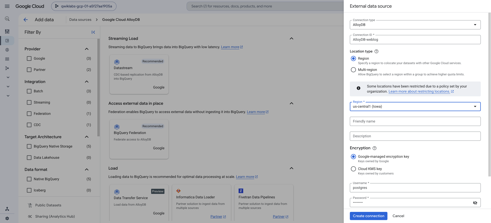

Bottom half of the same form: username `postgres`, the password from **your** lab's instructions panel, database `postgres`, and the full AlloyDB instance path — then **Create connection**.

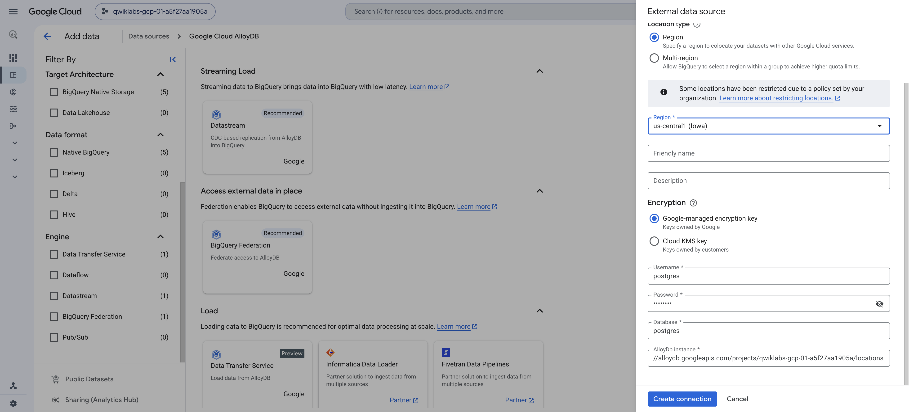

"AlloyDB-weblog" created. The linked server exists; nothing in it can be queried yet — its service account needs IAM first.

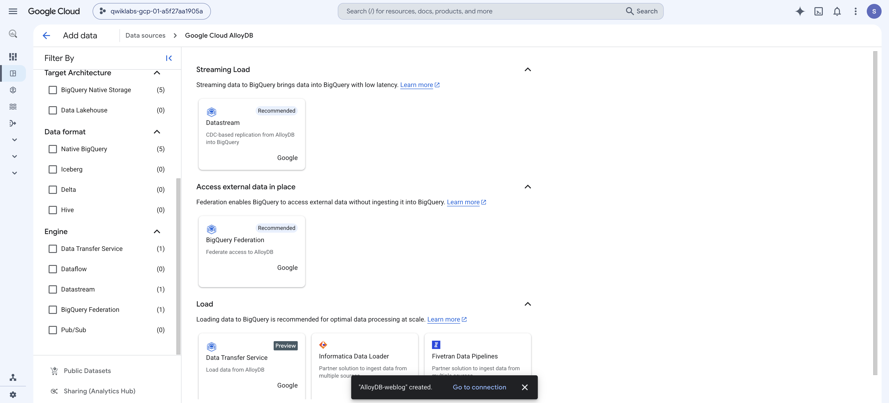

Open the connection (Pipelines & Connections ▸ Connections ▸ AlloyDB-weblog) and copy the **Service account id** — this is the principal the IAM grant goes to.

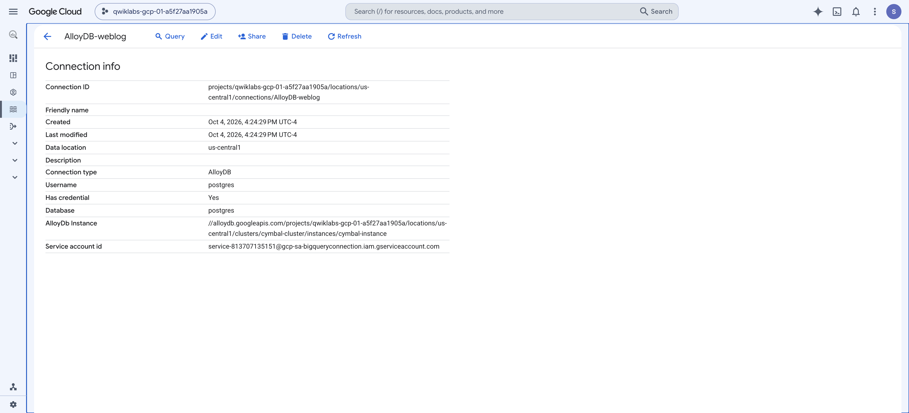

IAM ▸ **Grant access**: paste the service account, **press ENTER to make it a chip**, then add both roles — **AlloyDB Client** and **BigQuery Connection User** — and Save. Wait for the "Policy updated" toast.

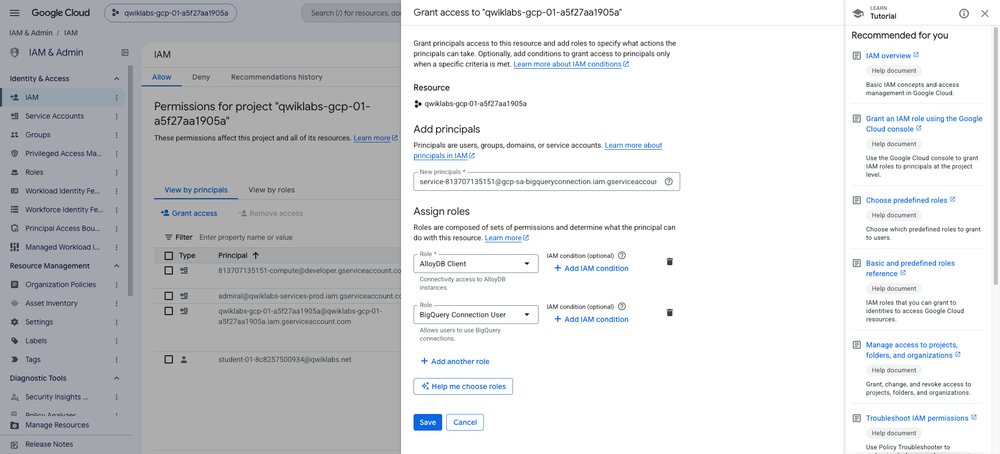

What the chip trap looks like: the email is in the box, yet Save says "Enter at least one principal" — the text was never committed as a chip.

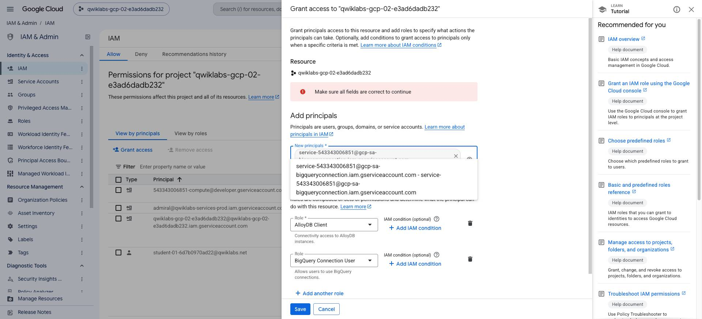

Self-check landmark: the connection shows under **Connections** in the Explorer tree, next to the `customers` dataset — remember, the AlloyDB tables will NOT appear here; federation is query-only.

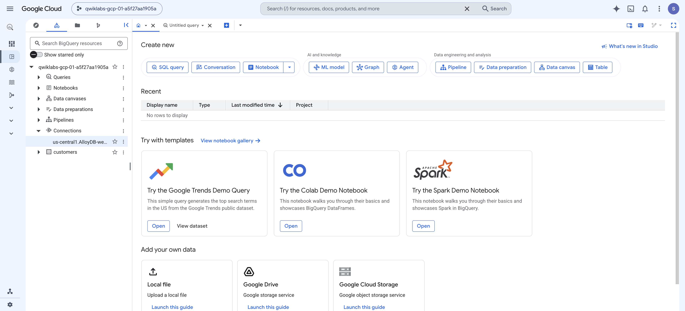

First `EXTERNAL_QUERY`, green: rows coming back from AlloyDB's `web_log` while you sit in BigQuery. The inner string ran as PostgreSQL on the AlloyDB side.

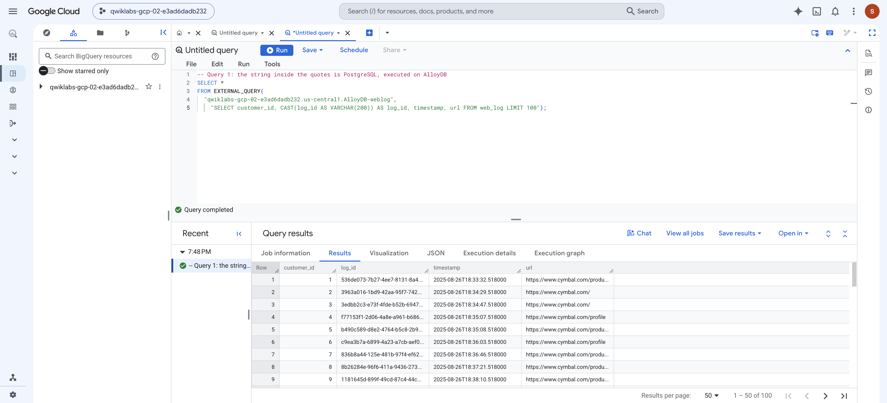

The payoff — one statement, two homes: `url`/`timestamp` from live AlloyDB rows joined with `traffic_source`, `zip` and `state` from the BigQuery customers table. If you get nothing else working in the lab, get this.

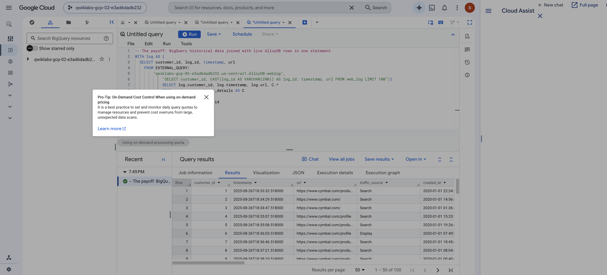

And when it goes wrong, this is the face of it — the PostgreSQL connection error with Google's own troubleshooting link. Nine times out of ten it is the IAM chip trap or the per-lab password.

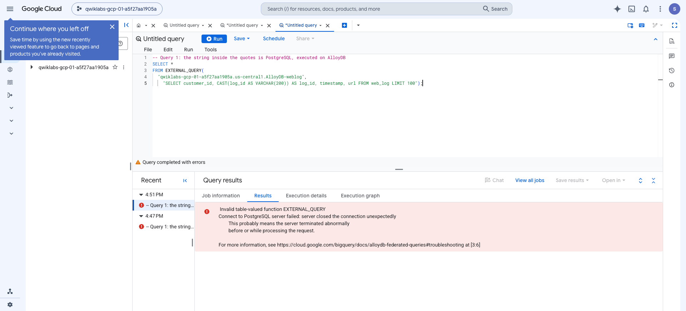

## Common gotchas

- **"Connect to PostgreSQL server failed: server closed the connection unexpectedly"** — this one error has two sneaky causes, both at setup time. First, credentials: the connection form values are per-lab — copy the password from YOUR running lab's instructions panel (it matches your console password), not from a stale manual page or a previous run. Second — and this one bites everyone — the IAM grant silently never happened: see the chip trap next.
- **The principal chip trap (the #1 silent failure):** when you paste the connection service account into "New principals" on the IAM "Grant access" panel, you MUST press Enter afterwards so the address turns into a chip — otherwise Save is rejected with "Enter at least one principal" (easy to miss: the email is sitting right there in the box). If you click a suggestion as well, you can end up with a duplicate chip — delete one with its ×. The grant only counts when you see the "Policy updated" toast; check the principal actually appears in the IAM list. Without this grant, every `EXTERNAL_QUERY` fails with the PostgreSQL connection error above.

- **Wrong project in the picker** — you created the connection in the wrong project and now nothing in the lab matches. Check the picker first whenever something "isn't there."
- **Connection ID typos in `EXTERNAL_QUERY`** — it must match exactly, in the form `region.connection-id` (for example `'us.my-connection'`).
- **Region alignment** — the connection resource's location must match where the query runs, and a single-region BigQuery setup can only federate to sources in the same region. If the lab says one region, use it everywhere.
- **BigQuery SQL inside the quotes** — the inner string is PostgreSQL. Backticks, GoogleSQL functions, and T-SQL habits all fail in there.
- **"Why can't I see the AlloyDB tables in the Explorer pane?"** — because federation is query-only. There is no table browsing; you write the inner query blind, exactly like `OPENQUERY`.

## If you finish early

- Run the inner PostgreSQL query on its own (just the string inside the quotes) to prove to yourself which side executes it.
- Add a filter inside the inner query — for example a `WHERE` or a `LIMIT` — and watch the remote side do the work before BigQuery sees a row.
- List the remote database's metadata through the same connection:
  ```sql
  SELECT * FROM EXTERNAL_QUERY("region.connection-id",
    "select * from information_schema.tables;");
  ```
  (swap in your connection ID — this is the PostgreSQL `information_schema`, not BigQuery's).
- Open the job's **Execution details** after the join and find what BigQuery reports for the federated step.

## Self-check

- [ ] I can see my connection resource under **External connections** in the BigQuery Explorer pane.
- [ ] My first `EXTERNAL_QUERY` returned rows from AlloyDB.
- [ ] I joined BigQuery historical data with live AlloyDB transactional rows in one query.
- [ ] I can explain which part of the query runs where: the inner string is PostgreSQL on AlloyDB; everything outside `EXTERNAL_QUERY` is GoogleSQL in BigQuery.
- [ ] I can name what this maps to in my current stack: a linked server definition plus `OPENQUERY`.

## What this replaces in your current stack

- **Linked servers, four-part names, and `OPENQUERY`** — the connection resource plus `EXTERNAL_QUERY` covers the same ground.
- **The nightly "extract the operational tables just so we can join them" jobs** — during the migration you query data where it lives and load it only when there's a reason to.

**The debrief in one line: querying data where it lives — that is the lakehouse promise.** Your Bronze lands in GCS/BigQuery, but anything still operational on the SQL Server side stays reachable during the migration. You don't have to move it all first.

## Dig deeper

- [Introduction to federated queries](https://cloud.google.com/bigquery/docs/federated-queries-intro) — region rules, quotas, pricing, SQL pushdowns
- [AlloyDB federated queries](https://cloud.google.com/bigquery/docs/alloydb-federated-queries) — including the `information_schema` trick above
- [AlloyDB overview](https://cloud.google.com/alloydb/docs/overview) — what the lab's stand-in operational store actually is
- Next: the same trick against files in Cloud Storage — [Exploring external tables](../05_activity-external-tables/activity-guide.md)

---

_Part of the Iowa DOM DoIT Data Engineering student pack — see `../00_schedule.md`._
