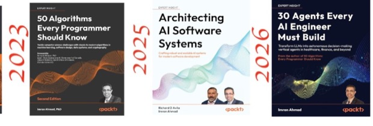

# Your Instructor — Imran Ahmad, PhD

 **Google Cloud Authorized Trainer · Google Certified Professional – Data Engineer · AWS Authorized Instructor (AAI) · Microsoft Certified Trainer (MCT) · Author, Packt Publishing** — [linkedin.com/in/cloudanum](https://www.linkedin.com/in/cloudanum/) · [github.com/cloudanum](https://github.com/cloudanum) · Ottawa, ON, Canada. 20+ years designing, building, and teaching large-scale data systems — across Google Cloud, AWS, and Azure.

## Multi-cloud by practice, not by slide

Imran works and teaches across all three major clouds — Google Cloud, AWS, and Azure — and holds instructor credentials on each side of the fence: **Google Cloud Authorized Trainer** and **Google Certified Professional Data Engineer**, **AWS Authorized Instructor (AAI)**, and **Microsoft Certified Trainer (MCT)**. That matters in this room: your world is SQL Server, SSIS, and Power BI, and your target is BigQuery — he is fluent in both, and can translate between them instead of reading you a Google script.

## Large-scale data engineering — the craft

- **Production pipelines at national scale.** He architects and builds production data pipelines over high-volume, multi-source datasets — distributed processing with PySpark and cloud data platforms feeding mission-critical, high-stakes workflows where reliability and auditability are not optional.
- **A PhD in data processing.** His doctoral research attacked the core problem of moving and processing very large datasets across distributed computing infrastructure — culminating in **a large-scale data-processing algorithm of his own design, built on cloud/grid computing**.
- **Pioneered techniques for large-scale processing.** That work introduced scheduling and data-movement techniques for processable bulk data that were ahead of their time — published in peer-reviewed venues (ACM, IEEE) and applied to real data-intensive science, including experiments generating **neutrino-particle data**.
- **A trainer of data teams.** Hundreds of corporate engagements worldwide — including data engineering and cloud training for **Citibank, JP Morgan, the United Nations, Deloitte, and the European Commission** — most of them, like yours, senior teams modernizing from on-prem platforms to cloud data stacks.

## AI and agents — the second act

- **Author of four Packt books**, including *30 Agents Every AI Engineer Must Build*, the bestselling *50 Algorithms Every Programmer Should Know*, and *Architecting AI Software Systems*.
- **Builds agentic AI systems for high-stakes, mission-critical workflows** — LLM-based extraction and triage systems delivered to production validation teams.
- **ATLAS** — an open-source, production-grade Agentic RAG platform (LangGraph, corrective RAG, self-verifying answers), built as a public showcase of industrial LLM engineering standards.
- Authored a 9-module *Designing and Deploying AI Agents* curriculum with a full lab series, and an *Agentic Security: Attack and Defend AI Agents* course; 32K+ followers read his writing on applied AI.

## In the classroom

Visiting Professor at the University of Ottawa, and a long-tenured authorized instructor with ROI Training. His calibration rule for this room: *you are senior in data engineering and new to one console — so we skip re-teaching what you own and spend our time on where things live in GCP.*

> "I build large data systems for a living. These two days map that craft onto Google Cloud — through your migration, not a generic tour."

## The books

***30 Agents Every AI Engineer Must Build*** (Packt) — thirty production-ready agent architectures: perception, memory, reasoning, planning, multi-agent collaboration, and ethical alignment. The full source code and labs are open: **github.com/PacktPublishing/30-Agents-Every-AI-Engineer-Must-Build**. His other titles: *50 Algorithms Every Programmer Should Know* (the bestseller, second edition), *40 Algorithms Every Programmer Should Know*, and *Architecting AI Software Systems*.

## Everything from class — links worth keeping

| Link | What it is |
|---|---|
| [survey.anum.cloud](https://survey.anum.cloud) | Pre-course survey — fill in your row before Monday 9:00 AM |
| [github.anum.cloud](https://github.anum.cloud) | This student pack — schedules, notes, lab companions, slides (Word + PDF) |
| [meet.google.com/ogk-ivdv-bhi](https://meet.google.com/ogk-ivdv-bhi) | Google Meet — join here both days, 9:00 AM CT |
| [Google Skills classroom](https://www.skills.google/ilt/classrooms/37990) | All hands-on labs (temporary GCP projects) |
| [Google check-in](https://docs.google.com/forms/d/e/1FAIpQLSeluwTkhuq7YxgHYVNHlzBSqjCLaHVOjE5ARh71moUpd-J53Q/viewform?usp=pp_url?usp=pp_url&entry.341732991=Oct%205-76444) | Google's attendance record for the class |
| [On-demand credits](https://docs.google.com/forms/d/1T6lBng3rkOtz5QQDklW0suwJ1J7YhkLO4xok9eXq_iI/viewform?edit_requested=true) | 50 free lab credits per training day, valid 30 days — re-run the labs after class |
| [Course evaluation](https://cloudlx.sjc1.qualtrics.com/jfe/form/SV_e2wogp4l1a2ByZL?qualtricsID=v88mg1hxsk) | 3 minutes at the end of Day 2 |
| [Book code](https://github.com/PacktPublishing/30-Agents-Every-AI-Engineer-Must-Build) | All 30 agents, open source |

## Google Cloud & data engineering — the reading list I hand to data teams

Curated from the ROI instructor community's *Google Cloud Helpful Links* doc, filtered to what your migration actually touches.

**BigQuery, end to end**

- [BigQuery introduction](https://docs.cloud.google.com/bigquery/docs/introduction) and [BigQuery under the hood](https://cloud.google.com/blog/products/bigquery/bigquery-under-the-hood) — start here
- [Standard SQL reference](https://docs.cloud.google.com/bigquery/docs/reference/standard-sql/query-syntax) — your T-SQL habits, translated
- [Partitioned tables](https://docs.cloud.google.com/bigquery/docs/partitioned-tables) and [clustered tables](https://docs.cloud.google.com/bigquery/docs/clustered-tables) — your tuning toolkit
- [Performance best practices](https://docs.cloud.google.com/bigquery/docs/best-practices-performance-overview), [query plan explanation](https://cloud.google.com/bigquery/query-plan-explanation), and [controlling costs](https://cloud.google.com/bigquery/docs/controlling-costs)
- [Batch loading](https://docs.cloud.google.com/bigquery/docs/batch-loading-data), the [Data Transfer Service](https://cloud.google.com/bigquery-transfer/docs/introduction), and [scheduled queries](https://docs.cloud.google.com/bigquery/docs/scheduling-queries)
- [External data on Cloud Storage](https://cloud.google.com/bigquery/external-data-cloud-storage) and [slots, explained](https://docs.cloud.google.com/bigquery/docs/slots)
- [bigquery-utils](https://github.com/GoogleCloudPlatform/bigquery-utils) — community UDFs worth stealing, and the [BigQuery sketchnote](https://github.com/priyankavergadia/GCPSketchnote/blob/main/images/BigQuery.png) for your wall

**Migration and replication**

- [Datastream overview](https://docs.cloud.google.com/datastream/docs/overview), [supported sources](https://docs.cloud.google.com/datastream/docs/sources), and the [replicate-to-BigQuery quickstart](https://docs.cloud.google.com/datastream/docs/quickstart-replication-to-bigquery)
- [Storage Transfer Service](https://cloud.google.com/storage-transfer/docs) and [on-premises transfers](https://cloud.google.com/storage-transfer/docs/on-prem-overview) — for the historical bulk moves

**Dataform — your Silver→Gold tool**

- [Dataform overview](https://docs.cloud.google.com/dataform/docs/overview), [SQL workflows](https://docs.cloud.google.com/dataform/docs/sql-workflows), [assertions](https://cloud.google.com/dataform/docs/assertions), and the [release lifecycle](https://cloud.google.com/dataform/docs/code-lifecycle) that maps to your CI/CD discipline

**Cloud Storage — your Bronze layer**

- [Introduction](https://docs.cloud.google.com/storage/docs/introduction), [best practices](https://docs.cloud.google.com/storage/docs/best-practices), [lifecycle management](https://docs.cloud.google.com/storage/docs/lifecycle), and the [gcloud storage CLI](https://docs.cloud.google.com/sdk/gcloud/reference/storage)

**Staying current**

- [Google Cloud blog — data analytics](https://cloud.google.com/blog/products/data-analytics), [release notes](https://docs.cloud.google.com/release-notes), and [what's new every week](https://cloud.google.com/blog/topics/inside-google-cloud/whats-new-google-cloud)
- [ROI Training's Google Cloud certification roadmap](https://www.roitraining.com/google-cloud-training-and-certification-roadmap/) — where to go after these two days (the 3-day Data Warehousing course is next)
- [Looker Studio with BigQuery](https://docs.cloud.google.com/bigquery/docs/visualize-looker-studio) — for the Power BI authors curious about the Google-side BI option

## Scan to connect

**[linkedin.com/in/cloudanum](https://www.linkedin.com/in/cloudanum/)** — course follow-ups welcome. That's where the agents writing, the book updates, and the weekly applied-AI newsletter live.
